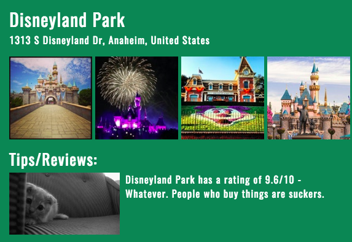

<b>Kitty Opinions</b> - <a href="https://www.thinkful.com">Thinkful</a> Capstone Project 
Rachel, here you go: https://ljyockey.github.io/kitty-opinions/

Search for any location using the Foursquare API and get the top 6 results in the form of buttons.  
When you click on a button, a lightbox opens with more info on that location as well as a tip/review.  
The tip/review contains the location's Foursquare rating, a Cat GIF and a Ron Swanson quote.  
If you can't decide on a location to search, there are 3 preloaded "popular locations" you can choose.  

<b>Languages</b> - HTML, CSS, JavaScript  
<b>Librairies</b> - 
	<a href="http://fancybox.net/">Fancybox</a>  
<b>APIs</b> - 
	<a href="https://foursquare.com/" target="blank" rel="noopener noreferrer">Foursquare</a>, 
	<a href="https://thecatapi.com/" target="blank" rel="noopener noreferrer">The Cat API</a>, 
	<a href="https://github.com/jamesseanwright/ron-swanson-quotes#ron-swanson-quotes-api" target="blank" rel="noopener noreferrer">Ron Swanson Quotes</a>
